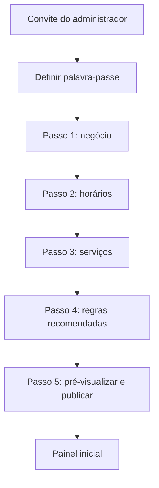
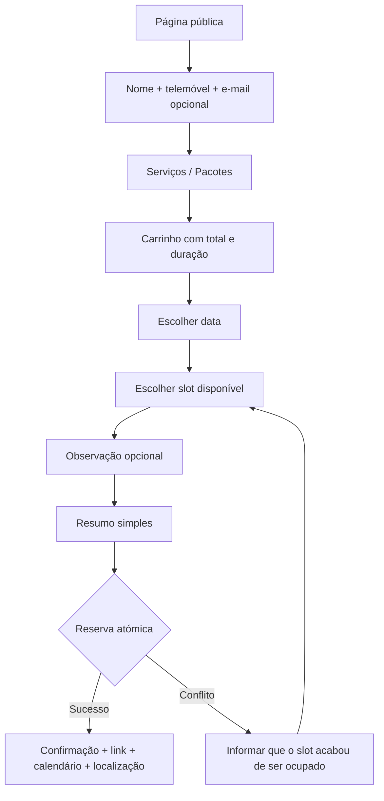

# 02 — Fluxos de UX

## Princípios

- Mobile-first.
- Uma ação primária por ecrã.
- Progresso visível.
- Erros junto ao campo, em linguagem simples.
- Preservar entradas em falhas recuperáveis.
- Não expor conceitos como tenant, token, RLS ou webhook.
- Feedback imediato com estado de carregamento e confirmação.
- Touch target mínimo de 44×44 px.

## Fluxo A — Primeiro acesso da dona

Regras:

- Pode voltar ao passo anterior sem perder dados.
- Progresso é guardado a cada passo.
- Publicação só é permitida após pelo menos um serviço ativo e um período de trabalho válido.

## Fluxo B — Marcação pública

### Estado de implementação da página pública (`/b/{slug}`)

A página pública (`src/app/b/[slug]/`) implementa hoje o Fluxo B completo,
paginado em rotas próprias (não um wizard de um único ecrã):

1. **Cadastro** (`NEX-051`) — nome + telemóvel (+ e-mail opcional) antes de escolher
   serviços; recuperável no mesmo dispositivo por 24h sem e-mail (`NEX-052`),
   com rascunho cifrado (`booking_drafts`, `BOOKING_DRAFT_ENCRYPTION_KEY`).
2. **`/b/{slug}/servicos`** — serviços agrupados por categoria (checkboxes);
   pacote de escolha única (`radio`, PRD 01 §4: "aba separada"); extras — serviços
   avulsos combinados com um pacote — nunca duplicam um item já incluído no pacote
   escolhido (`src/app/b/[slug]/domain/booking-selection.ts`, `NEX-053`); barra de
   total/duração ao vivo (`NEX-054`, "sem float", recalcula em direto).
3. **`/b/{slug}/horario`** — escolha do dia e do horário disponível, servida pelo
   motor de disponibilidade real (`EPIC-06`: `NEX-060` a `NEX-066` — geração de
   slots timezone-aware, consulta pública, constraint de não sobreposição no
   Postgres, rate limit/proteção anti-bot).
4. **`/b/{slug}/dados`** — observação opcional.
5. **`/b/{slug}/resumo`** — resumo final e confirmação via reserva atómica e
   idempotente (Route Handler `/api/public/business/[slug]/bookings`,
   `NEX-064`), protegida contra dupla marcação por constraint de exclusão na
   base de dados e testada sob concorrência real até 15 pedidos simultâneos
   (`NEX-175`). Em caso de conflito (`SLOT_TAKEN`), a UX preserva os dados
   escolhidos e volta ao passo de horário (`NEX-065`) em vez de apenas
   mostrar um erro genérico. Ecrã final de confirmação com ficheiro `.ics`,
   "Como chegar" e e-mail opcional (`NEX-070` a `NEX-074`).

O link `wa.me` deixou de ser o mecanismo de confirmação — é hoje um canal
manual de lembrete (Fluxo D), não parte da reserva em si.

Bug de concorrência real encontrado e corrigido em produção (cliente ficava
preso em "A confirmar…" quando duas visitantes confirmavam o mesmo horário
ao mesmo tempo) — ver `docs/evidence/NEX-178_PUBLIC_BOOKING_CLIENT_CONCURRENCY.md`.
Este fluxo tem cobertura E2E `@critical` em CI (`tests/e2e/`, job
`e2e-critical` em `.github/workflows/ci.yml`).

## Fluxo C — Agenda diária

1. Dona abre o painel.
2. Próxima cliente aparece em destaque.
3. Cartões mostram atendimentos por hora.
4. “Abrir WhatsApp” gera deep link com mensagem.
5. “Concluir” abre modal rápido.
6. Se necessário, “Ver mais” abre ajustes.
7. Pagamento é registado e o cartão muda para concluído.

## Fluxo D — Lembrete manual

1. Item entra na lista 24 horas antes.
2. Dona toca em “Abrir WhatsApp”.
3. Sistema regista somente `opened_at`.
4. Dona envia manualmente.
5. Ao regressar, toca em “Marcar como enviado”.
6. Sistema regista `marked_sent_at` e nunca apresenta “entregue/lido”.

## Fluxo E — Recorrência

1. Dona seleciona cliente e serviços.
2. Escolhe frequência e quantidade.
3. Sistema simula todas as ocorrências.
4. Conflitos são apresentados juntos com alternativas.
5. Dona resolve cada conflito.
6. Confirma a série em transação.

## Estados vazios

- Sem marcações: ação “Criar marcação”.
- Sem serviços: ação “Criar primeiro serviço”.
- Sem clientes: explicar que clientes surgem após marcação ou cadastro manual.
- Sem lembretes: mensagem positiva, sem mostrar tabela vazia.

## Acessibilidade

- Todos os estados têm texto e ícone, não apenas cor.
- Modais prendem foco e devolvem foco ao fechar.
- Calendário é utilizável por teclado.
- Erros usam `aria-describedby`.
- Animações respeitam `prefers-reduced-motion`.
- Contraste deve passar AA mesmo com sombras e tons rosa.
