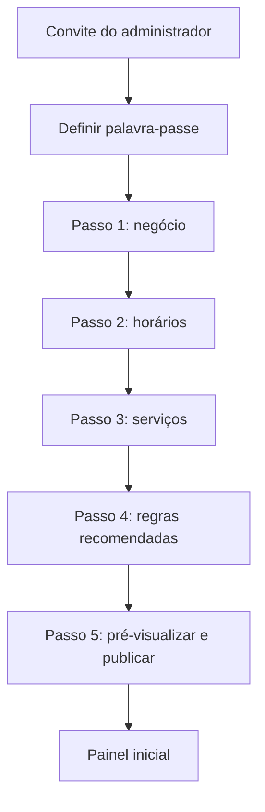
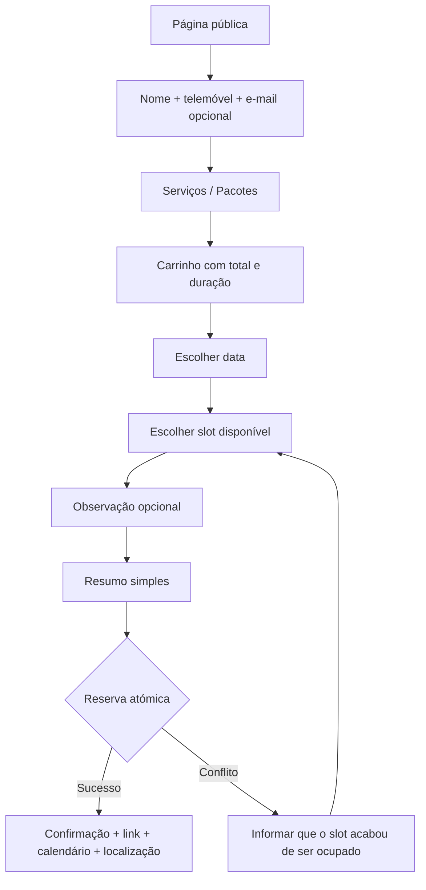

# 02 — Fluxos de UX

## Princípios

- Mobile-first.
- Uma ação primária por ecrã.
- Progresso visível.
- Erros junto ao campo, em linguagem simples.
- Preservar entradas em falhas recuperáveis.
- Não expor conceitos como tenant, token, RLS ou webhook.
- Feedback imediato com estado de carregamento e confirmação.
- Touch target mínimo de 44×44 px.

## Fluxo A — Primeiro acesso da dona

Regras:

- Pode voltar ao passo anterior sem perder dados.
- Progresso é guardado a cada passo.
- Publicação só é permitida após pelo menos um serviço ativo e um período de trabalho válido.

## Fluxo B — Marcação pública

### Estado de implementação da página pública (`/b/{slug}`)

A página pública (`src/app/b/[slug]/`) implementa por agora as duas primeiras fases do
Fluxo B. Fases ainda por implementar, pela ordem completa do Fluxo B acima:

1. **Cadastro** (`NEX-051`) — nome + telemóvel (+ e-mail opcional) antes de escolher
   serviços; recuperável no mesmo dispositivo por 24h sem e-mail (`NEX-052`).
2. **Serviços/Pacotes + carrinho** — serviços agrupados por categoria (checkboxes);
   pacote de escolha única (`radio`, PRD 01 §4: "aba separada"); extras — serviços
   avulsos combinados com um pacote — nunca duplicam um item já incluído no pacote
   escolhido (`src/app/b/[slug]/domain/booking-selection.ts`, `NEX-053`); barra de
   total/duração ao vivo (`NEX-054` cobre a formalização do carrinho fixo com testes
   próprios — a versão atual já cumpre "sem float" e "recalcula ao vivo").
3. **Escolha do dia** e do horário disponível (depende do motor de disponibilidade,
   `EPIC-06`, ainda não construído).
4. Observação opcional + resumo final + confirmação (reserva atómica) — por agora, a
   confirmação é só um link `wa.me` com a seleção itemizada (sem motor de marcação).

A versão formal e testada desta página fica para `NEX-050` em diante.

## Fluxo C — Agenda diária

1. Dona abre o painel.
2. Próxima cliente aparece em destaque.
3. Cartões mostram atendimentos por hora.
4. “Abrir WhatsApp” gera deep link com mensagem.
5. “Concluir” abre modal rápido.
6. Se necessário, “Ver mais” abre ajustes.
7. Pagamento é registado e o cartão muda para concluído.

## Fluxo D — Lembrete manual

1. Item entra na lista 24 horas antes.
2. Dona toca em “Abrir WhatsApp”.
3. Sistema regista somente `opened_at`.
4. Dona envia manualmente.
5. Ao regressar, toca em “Marcar como enviado”.
6. Sistema regista `marked_sent_at` e nunca apresenta “entregue/lido”.

## Fluxo E — Recorrência

1. Dona seleciona cliente e serviços.
2. Escolhe frequência e quantidade.
3. Sistema simula todas as ocorrências.
4. Conflitos são apresentados juntos com alternativas.
5. Dona resolve cada conflito.
6. Confirma a série em transação.

## Estados vazios

- Sem marcações: ação “Criar marcação”.
- Sem serviços: ação “Criar primeiro serviço”.
- Sem clientes: explicar que clientes surgem após marcação ou cadastro manual.
- Sem lembretes: mensagem positiva, sem mostrar tabela vazia.

## Acessibilidade

- Todos os estados têm texto e ícone, não apenas cor.
- Modais prendem foco e devolvem foco ao fechar.
- Calendário é utilizável por teclado.
- Erros usam `aria-describedby`.
- Animações respeitam `prefers-reduced-motion`.
- Contraste deve passar AA mesmo com sombras e tons rosa.
