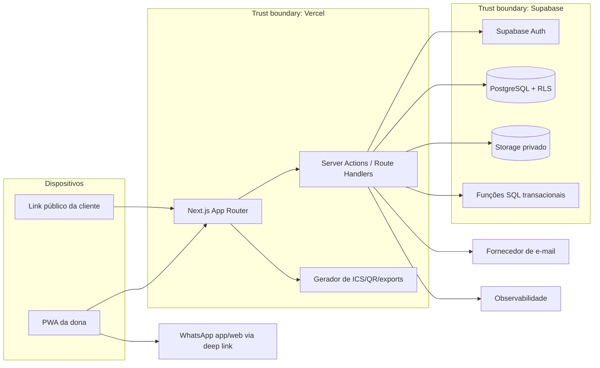

# 03 — Arquitetura proposta

## Decisão

Monólito modular Next.js implantado na Vercel, com Supabase como PostgreSQL, Auth e Storage. Esta escolha reduz complexidade operacional no MVP sem comprometer isolamento multi-tenant.

## Diagrama

## Componentes

### Next.js

- App Router.
- Server Components por padrão.
- Client Components apenas para interação local.
- Server Actions/Route Handlers como BFF.
- Validação Zod nos limites.
- Sem acesso direto do browser a dados privados que não estejam protegidos por RLS.

### Supabase

- Auth por e-mail/palavra-passe apenas para a dona.
- PostgreSQL como fonte de verdade.
- RLS obrigatória em todas as tabelas tenant-scoped.
- Storage privado para fotografias.
- RPC/transação para reserva atómica.

### Vercel

- Deploy previews por PR.
- Produção na branch protegida.
- Variáveis separadas por ambiente.
- Sem cron obrigatório para lembretes manuais: a lista é calculada ao abrir e pode ser atualizada por polling seguro.

## Multi-tenancy

Modelo inicial: base e schema partilhados, com `tenant_id` em recursos de negócio.

Regras:

- `tenant_id` vem da sessão/perfil da dona.
- Rotas públicas resolvem tenant por `slug`, mas só expõem catálogo e dados públicos mínimos.
- RLS impede acesso cruzado.
- Queries internas sem escopo de tenant são proibidas por convenção e testes.
- Logs e exports devem carregar `tenant_id` internamente, sem exibi-lo à cliente.

## Concorrência de agenda

A proteção definitiva é na base:

- `start_at` e `blocked_until` em UTC;
- constraint de exclusão GiST por tenant para estados que ocupam agenda;
- criação pública em função transacional;
- conflito retorna código semântico `SLOT_TAKEN`;
- UI atualiza slots e pede nova escolha.

## Tempo e timezone

- Persistir `timestamptz` em UTC.
- Tenant guarda timezone IANA, padrão `Europe/Lisbon`.
- Cálculos de calendário usam timezone do tenant.
- Testes cobrem mudanças de horário de verão.

## E-mail

- Interface `EmailProvider` desacoplada.
- Primeiro adaptador recomendado: Resend ou equivalente configurado por ambiente.
- Falha de e-mail não desfaz reserva; cria evento operacional para retry/alerta.

## PWA

- Manifest e ícones.
- Instalável.
- Cache somente de assets estáticos e shell seguro.
- Dados de agenda não ficam disponíveis offline no MVP.
- Não fazer cache de respostas autenticadas ou links secretos.

## Observabilidade

- logs JSON estruturados;
- request/correlation ID;
- métricas de reservas, conflitos, erros, latência e envios;
- auditoria de ações administrativas e financeiras;
- redaction de PII.

## SLO inicial

- Disponibilidade mensal: 99,5%.
- p95 de leitura pública: < 800 ms, excluindo cold start/terceiros.
- p95 de confirmação de reserva: < 1,5 s.
- RPO: 24 h no MVP, objetivo 1 h após validação de custos.
- RTO: 4 h.

## Evolução

A arquitetura permite adicionar perfis de equipa e múltiplas agendas, mas essas capacidades permanecem atrás de feature flags e não aparecem no MVP.
