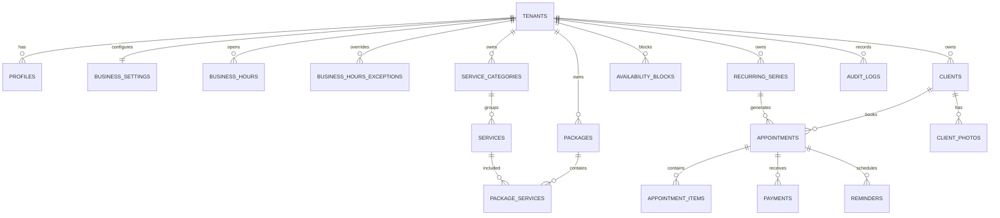

# 04 — Modelo de dados

## Regras gerais

- IDs UUID aleatórios.
- Todos os recursos de negócio têm `tenant_id`.
- Referências entre tabelas tenant-scoped usam FK compostas `(tenant_id, id)`, não apenas `id` — impede estruturalmente que uma linha aponte para um recurso de outro tenant, como defesa em profundidade além da RLS (`NEX-011`, `supabase/migrations/0002_harden_tenant_fk_integrity.sql`).
- Dinheiro em `bigint`/inteiro de cêntimos.
- Datas de evento em `timestamptz`.
- Soft delete apenas quando necessário; preferir estados explícitos.
- Tokens públicos armazenados como SHA-256, nunca em texto claro.
- `created_at` e `updated_at` em entidades mutáveis; `updated_at` é mantido por trigger de base de dados (`set_updated_at`), não pela aplicação.
- `audit_logs` é append-only, enforced por trigger `BEFORE UPDATE/DELETE` (`NEX-014`, `0004_audit_logs_immutable.sql`) — RLS sozinha não bastava porque `service_role` tem `BYPASSRLS`. Consequência: um tenant com histórico de auditoria não pode ser `DELETE`d (só soft delete via `tenant_status='deleted'`); `audit_logs.tenant_id` é `on delete restrict`, não `set null`.
- `business_hours.day_of_week` segue a convenção `Date.getDay()` do JavaScript: `0` = domingo, `6` = sábado. Não estava especificado em lado nenhum antes de `NEX-032`; adotado porque o motor de disponibilidade (`NEX-060`/`061`) deve calcular isto a partir de `Date` nativo.
- `business_hours_exceptions` (`NEX-060`, `0006_business_hours_exceptions.sql`) redefine o horário de `business_hours` para uma `exception_date` específica ("horário especial", `01_PRODUCT_REQUIREMENTS.md` §3) — distinto de `availability_blocks`, que só marca tempo indisponível dentro/à volta do horário normal ("bloqueios", "férias") sem alterar o que esse horário normal é. O motor de disponibilidade deve preferir a exceção sobre `business_hours` na data correspondente, e só depois subtrair `availability_blocks` sobrepostos. Sem política `anon`, tal como `business_hours` — a agenda em bruto nunca é exposta diretamente ao público, só os slots computados (função `security definer`, `NEX-061`/`062`, padrão `ADR-008`).
- `appointments.idempotency_key_hash`/`idempotency_payload_hash` (`NEX-064`, `0007_create_public_booking.sql`): suportam idempotência de `create_public_booking` — a chave (fornecida pelo caller, gerada no browser para sobreviver a retries) é guardada só como hash (mesmo padrão de `booking_token_hash`), pareada com um hash do payload relevante. Uma repetição com a mesma chave e o mesmo payload devolve o `appointment_id` original sem recriar a marcação nem reemitir o token (que só sai uma vez, `docs/06_API_CONTRACTS.md`); a mesma chave com payload diferente é rejeitada (`IDEMPOTENCY_CONFLICT`). Índice único parcial em `(tenant_id, idempotency_key_hash) where idempotency_key_hash is not null` — marcações administrativas futuras (`NEX-085`) não passam chave, por isso `null` fica fora do índice.

## Entidades principais

## Classificação

| Dado                   | Classificação                                      | Retenção inicial                                    |
| ---------------------- | -------------------------------------------------- | --------------------------------------------------- |
| Catálogo público       | Público                                            | enquanto ativo + histórico de auditoria             |
| Nome/telemóvel/e-mail  | Confidencial/PII                                   | relação ativa + prazo jurídico a validar            |
| Observações da cliente | Confidencial                                       | mínimo necessário; revisão periódica                |
| Fotografias            | Confidencial; potencialmente sensível por contexto | configurável; apagar sob pedido quando aplicável    |
| Pagamentos internos    | Confidencial                                       | prazo fiscal/contabilístico a validar; não é fatura |
| Audit logs             | Interno/confidencial                               | 12 meses inicial, sujeito a revisão                 |
| Booking drafts         | Confidencial temporário                            | 24 h máximo                                         |

## Invariantes

- Não há sobreposição de intervalos que ocupam a mesma agenda/tenant.
- Um appointment item é snapshot e não muda quando o serviço é editado.
- `expected_total_cents` é calculado na reserva.
- `final_total_cents` só é definido no fecho.
- Soma de pagamentos confirmados não pode exceder total final sem evento explícito de reembolso/ajuste.
- Cliente é deduplicada por `tenant_id + phone_e164`, com resolução manual em colisões legítimas.
- Package não pode conter o mesmo serviço duas vezes.
- Duração de pacote é soma das durações dos serviços.

## Índices mínimos

- `appointments(tenant_id, start_at)`.
- `appointments(client_id, start_at desc)`.
- `clients(tenant_id, phone_e164)` unique.
- `services(tenant_id, active, sort_order)`.
- `reminders(tenant_id, due_at, status)`.
- `audit_logs(tenant_id, created_at desc)`.
- GIN somente após medição para campos JSONB.

## Eliminação

- Eliminação de tenant deve ser job controlado, auditado e testado.
- Fotografias devem ser removidas do Storage e referências.
- Backups seguem expiração natural documentada; pedidos de eliminação são registados para impedir restauração definitiva sem reaplicar tombstones.
