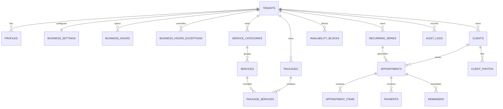

# 04 — Modelo de dados

## Regras gerais

- IDs UUID aleatórios.
- Todos os recursos de negócio têm `tenant_id`.
- Referências entre tabelas tenant-scoped usam FK compostas `(tenant_id, id)`, não apenas `id` — impede estruturalmente que uma linha aponte para um recurso de outro tenant, como defesa em profundidade além da RLS (`NEX-011`, `supabase/migrations/0002_harden_tenant_fk_integrity.sql`).
- Dinheiro em `bigint`/inteiro de cêntimos.
- Datas de evento em `timestamptz`.
- Soft delete apenas quando necessário; preferir estados explícitos.
- Tokens públicos armazenados como SHA-256, nunca em texto claro.
- `created_at` e `updated_at` em entidades mutáveis; `updated_at` é mantido por trigger de base de dados (`set_updated_at`), não pela aplicação.
- `audit_logs` é append-only, enforced por trigger `BEFORE UPDATE/DELETE` (`NEX-014`, `0004_audit_logs_immutable.sql`) — RLS sozinha não bastava porque `service_role` tem `BYPASSRLS`. Consequência: um tenant com histórico de auditoria não pode ser `DELETE`d (só soft delete via `tenant_status='deleted'`); `audit_logs.tenant_id` é `on delete restrict`, não `set null`.
- `business_hours.day_of_week` segue a convenção `Date.getDay()` do JavaScript: `0` = domingo, `6` = sábado. Não estava especificado em lado nenhum antes de `NEX-032`; adotado porque o motor de disponibilidade (`NEX-060`/`061`) deve calcular isto a partir de `Date` nativo.
- `business_hours_exceptions` (`NEX-060`, `0006_business_hours_exceptions.sql`) redefine o horário de `business_hours` para uma `exception_date` específica ("horário especial", `01_PRODUCT_REQUIREMENTS.md` §3) — distinto de `availability_blocks`, que só marca tempo indisponível dentro/à volta do horário normal ("bloqueios", "férias") sem alterar o que esse horário normal é. O motor de disponibilidade deve preferir a exceção sobre `business_hours` na data correspondente, e só depois subtrair `availability_blocks` sobrepostos. Sem política `anon`, tal como `business_hours` — a agenda em bruto nunca é exposta diretamente ao público, só os slots computados (função `security definer`, `NEX-061`/`062`, padrão `ADR-008`).
- `appointments.idempotency_key_hash`/`idempotency_payload_hash` (`NEX-064`, `0007_create_public_booking.sql`): suportam idempotência de `create_public_booking` — a chave (fornecida pelo caller, gerada no browser para sobreviver a retries) é guardada só como hash (mesmo padrão de `booking_token_hash`), pareada com um hash do payload relevante. Uma repetição com a mesma chave e o mesmo payload devolve o `appointment_id` original sem recriar a marcação nem reemitir o token (que só sai uma vez, `docs/06_API_CONTRACTS.md`); a mesma chave com payload diferente é rejeitada (`IDEMPOTENCY_CONFLICT`). Índice único parcial em `(tenant_id, idempotency_key_hash) where idempotency_key_hash is not null` — marcações administrativas futuras (`NEX-085`) não passam chave, por isso `null` fica fora do índice.
- `clients.preferences` (`jsonb`, default `'{}'`) ganhou a sua primeira forma concreta em `NEX-091` (`src/features/clients/domain/preferences.ts`): `{ colors, formats, techniques, products }`, quatro campos de texto livre (`docs/01_PRODUCT_REQUIREMENTS.md` §10 — "preferências de cores, formatos, técnicas e produtos"), não uma taxonomia estruturada. `parseClientPreferences` faz parse tolerante — dados legados/malformados nunca lançam exceção, caem para todos os campos vazios.
- `business_settings.no_show_limit`/`no_show_window_days` (`NEX-095`, `0011_no_show_policy.sql`): política de faltas apenas de alerta, nunca bloqueio automático (decisão de produto — a dona decide caso a caso). `no_show_limit` é `null` por omissão (política desligada); quando definido (2–5), a ficha da cliente mostra um aviso quando o número de marcações com `status='no_show'` dentro dos últimos `no_show_window_days` (30/60/90/180, default 90) atinge o limite. `appointment_status.no_show` já existia desde `0001_initial.sql` mas nada o conseguia atingir antes desta tarefa — `mark_appointment_no_show` (mesmo padrão de `cancel_appointment`, `NEX-084`) é o único caminho para lá chegar, chamável apenas pela própria sessão autenticada da dona.
- `reminders` (`NEX-100`, `0012_reminder_lifecycle.sql`): `due_at = start_at - 24h` é definido na criação (`create_public_booking`/`create_manual_booking`, `0007`/`0009`) e realinhado por `reschedule_appointment` sempre que o lembrete ainda está `pending` — um lembrete já `opened`/`marked_sent` não é tocado, porque a dona já agiu sobre ele e reabrir essa decisão não é papel do reagendamento. `cancel_appointment` e `mark_appointment_no_show` marcam um lembrete `pending` como `skipped` (nunca apagam a linha — `reminders` fica como registo histórico do que foi/não foi avisado).
- `mark_reminder_opened`/`mark_reminder_sent` (`NEX-103`, `0013_reminder_engagement.sql`) nunca alegam entrega ou leitura (`docs/01_PRODUCT_REQUIREMENTS.md` §8) — `opened` só significa que a dona clicou em "Abrir WhatsApp", `marked_sent` só significa que ela confirmou manualmente ter enviado. Ambas são idempotentes por desenho (clicar duas vezes não regride o estado nem duplica a entrada em `audit_logs`), ao contrário de `cancel_appointment`/`reschedule_appointment`/`mark_appointment_no_show`, cujo estado só pode acontecer uma vez.
- `business_settings.reminder_message_template` (`NEX-104`, `0014_reminder_template.sql`): `null` por omissão usa `DEFAULT_REMINDER_TEMPLATE` (`src/features/reminders/domain/template.ts`). Só os placeholders `{{cliente}}`, `{{data}}` e `{{hora}}` são substituídos — a validação do allowlist corre no servidor (`updateReminderTemplate`), nunca só no cliente. `renderReminderTemplate` substitui num único passe sobre o template original (regex com replacer, não `.replaceAll()` encadeado) — encadear substituições reabriria a string já modificada a cada passo, permitindo que o valor de um placeholder (ex.: o nome de uma cliente contendo literalmente `"{{data}}"`) fosse reinterpretado como outro placeholder na substituição seguinte.
- `complete_appointment` (`NEX-110`/`NEX-113`, `0015_complete_appointment.sql`; estendida com extras em `NEX-111`, `0016_complete_appointment_extras.sql`): atualiza `appointments` (`status='completed'`, `completed_at`, `final_total_cents`), insere `appointment_items` para cada extra, insere a linha `payments` correspondente, e escreve `audit_logs` numa única transação — uma falha a meio (ex. `final_total_cents` negativo, extra manual com preço negativo) reverte tudo, nunca deixa uma marcação `completed` sem pagamento ou com itens parciais. `p_final_total_cents` vem sempre do chamador (ao contrário dos snapshots de preço no booking) porque esta é uma ação autenticada da própria dona sobre o seu tenant, não um cálculo de preço público manipulável. `payment_method`/`payment_status` seguem a mesma regra da constraint de `payments` (`0001_initial.sql`): método presente sse status ≠ `pending`. Repetir a chamada sobre uma marcação já `completed` falha com `22023`, sem duplicar o pagamento (idempotência por rejeição, não por no-op — ao contrário de `mark_reminder_sent`, aqui uma segunda tentativa é sempre um erro do chamador, nunca um clique duplo legítimo).
- Extras (`NEX-111`): `p_extra_service_ids` volta a ser re-precificado a partir do catálogo vivo (mesma disciplina de `create_public_booking`/`create_manual_booking` — nunca confia no preço vindo do cliente), inserido como `appointment_items.source_type='service'`. `p_manual_extras` (`jsonb`, `[{description, unitPriceCents}]`) é "ajuste manual" — a descrição e o preço são confiados do chamador (mesmo limite de confiança do próprio `p_final_total_cents`), mas validados quanto à forma (descrição 1–200 caracteres, preço ≥ 0) antes de inserir como `source_type='manual_extra'`, `source_id=null`.
- Desconto (`NEX-112`, `0017_complete_appointment_discount.sql`): guardado como `appointment_items.source_type='discount'` com `unit_price_cents` **negativo** — não há coluna de desconto separada; somar todos os `appointment_items` de uma marcação já dá o total efetivamente cobrado, desconto incluído. `p_discount_type` (`'fixed'`/`'percent'`) e `p_discount_value` são confiados do chamador, mas o valor calculado do desconto é sempre `least(valor, p_final_total_cents)` — nunca pode exceder o total que está a descontar ("total nunca negativo"), e percentagem é calculada sobre `p_final_total_cents` (o valor com extras já incluídos), não sobre `expected_total_cents`. `p_discount_reason` é opcional; quando presente, é anexado à descrição do item (`"Desconto — {motivo}"`).

## Entidades principais

## Classificação

| Dado                   | Classificação                                      | Retenção inicial                                    |
| ---------------------- | -------------------------------------------------- | --------------------------------------------------- |
| Catálogo público       | Público                                            | enquanto ativo + histórico de auditoria             |
| Nome/telemóvel/e-mail  | Confidencial/PII                                   | relação ativa + prazo jurídico a validar            |
| Observações da cliente | Confidencial                                       | mínimo necessário; revisão periódica                |
| Fotografias            | Confidencial; potencialmente sensível por contexto | configurável; apagar sob pedido quando aplicável    |
| Pagamentos internos    | Confidencial                                       | prazo fiscal/contabilístico a validar; não é fatura |
| Audit logs             | Interno/confidencial                               | 12 meses inicial, sujeito a revisão                 |
| Booking drafts         | Confidencial temporário                            | 24 h máximo                                         |

## Invariantes

- Não há sobreposição de intervalos que ocupam a mesma agenda/tenant.
- Um appointment item é snapshot e não muda quando o serviço é editado.
- `expected_total_cents` é calculado na reserva.
- `final_total_cents` só é definido no fecho.
- Soma de pagamentos confirmados não pode exceder total final sem evento explícito de reembolso/ajuste.
- Cliente é deduplicada por `tenant_id + phone_e164`, com resolução manual em colisões legítimas.
- Package não pode conter o mesmo serviço duas vezes.
- Duração de pacote é soma das durações dos serviços.

## Índices mínimos

- `appointments(tenant_id, start_at)`.
- `appointments(client_id, start_at desc)`.
- `clients(tenant_id, phone_e164)` unique.
- `services(tenant_id, active, sort_order)`.
- `reminders(tenant_id, due_at, status)`.
- `audit_logs(tenant_id, created_at desc)`.
- GIN somente após medição para campos JSONB.

## Eliminação

- Eliminação de tenant deve ser job controlado, auditado e testado.
- Fotografias devem ser removidas do Storage e referências.
- Backups seguem expiração natural documentada; pedidos de eliminação são registados para impedir restauração definitiva sem reaplicar tombstones.
